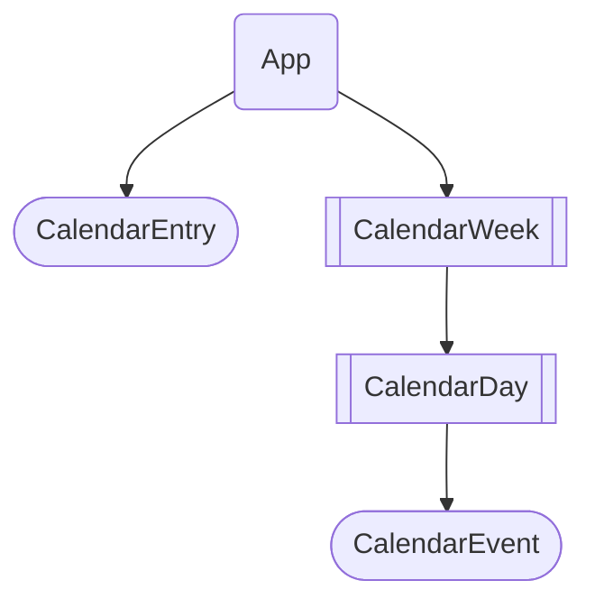
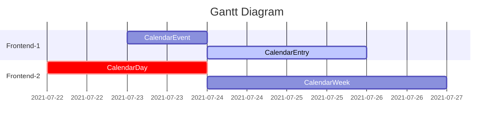

# Calendar project in Vue.js

## Project setup

```script
npm install
```

### Compiles and hot-reloads for development

```script
npm run serve
```

### Compiles and minifies for production

```script
npm run build
```

### Lints and fixes files

```script
npm run lint
```

### Customize configuration
See [Configuration Reference](https://cli.vuejs.org/config/).

### Branches Info
* main: vue3+bulma
* bootstrap: vue3+bootstrap5

### Vue Upgrade
*`npm install -g @vue/cli@next`
* Vue/Cli: 5.0.0
* Vue: 3.2.23
* [Vue 2 vs Vue 3 and Migration Notes](https://github.com/frzhen/vue-calendar/blob/bootstrap/Migration_V2_to_V3.md)


************************************************************

_The following markup only supported in Gitlab mermaid plugin_
### Vue Component Structure



#### gantt chart example


