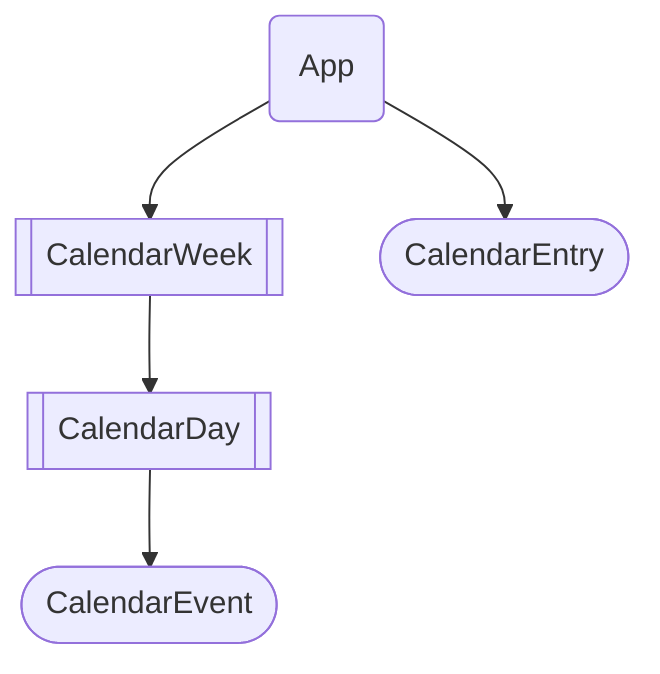
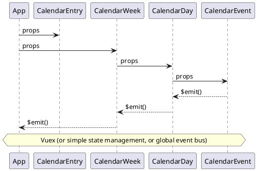
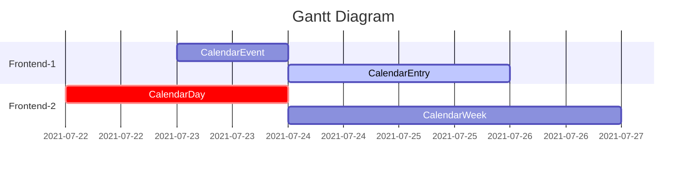

# Calendar project in Vue.js

### Branches Info
* main: vue3+bulma+Fontawesome

### Vue Upgrade
*`npm install -g @vue/cli@next`
* Vue/Cli: 5.0.0
* Vue: 3.2.23
* [Vue 2 vs Vue 3 and Migration Notes](https://github.com/frzhen/vue-calendar/blob/bootstrap/Migration_V2_to_V3.md)

### Project setup
* Install Dependencies: 
```script
npm install
```
* Compiles and hot-reloads for development
```script
npm run serve
```
* Compiles and minifies for production
```script
npm run build
```
* Lints and fixes files
```script
npm run lint
```
### Customize configuration
See [Configuration Reference](https://cli.vuejs.org/config/).
************************************************************
_The following markup only supported in mermaid plugin_
   - [add chrome extension for mermaid](https://chrome.google.com/webstore/detail/mermaid-diagrams/phfcghedmopjadpojhmmaffjmfiakfil/related)
   - [add chrome externsion for PlantUML](https://chrome.google.com/webstore/detail/plantuml-visualizer/ffaloebcmkogfdkemcekamlmfkkmgkcf/related)
   - [add webstorm plugin from: `prefereence->Language & Frameworks->Markedown` Select Mermaid or PlantUML](https://www.jetbrains.com/help/webstorm/markdown.html#diagrams)
### Vue Component Structure



### Other Structure Documentation:
* [store.js structure](https://github.com/frzhen/vue-calendar/blob/main/src/store.md)

#### gantt chart example

