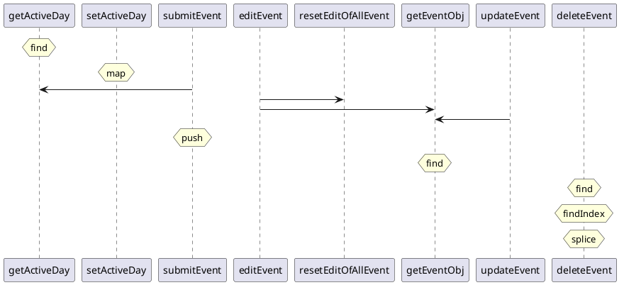

### store.js Structure

```plantuml
@startuml

hnote over getActiveDay : find
hnote over setActiveDay : map
submitEvent -> getActiveDay
editEvent -> resetEditOfAllEvent
editEvent -> getEventObj
updateEvent -> getEventObj
hnote over submitEvent : push
hnote over getEventObj : find
hnote over deleteEvent : find
hnote over deleteEvent : findIndex
hnote over deleteEvent : splice

@enduml
```

