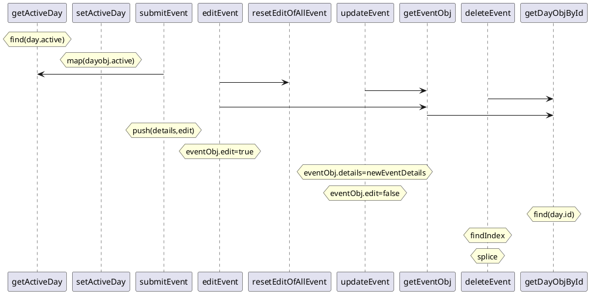

### store.js Structure

```plantuml
@startuml

hnote over getActiveDay : find(day.active)
hnote over setActiveDay : map(dayobj.active)
submitEvent -> getActiveDay
editEvent -> resetEditOfAllEvent
updateEvent -> getEventObj
deleteEvent -> getDayObjById
editEvent -> getEventObj
getEventObj -> getDayObjById
hnote over submitEvent : push(details,edit)
hnote over editEvent : eventObj.edit=true
hnote over updateEvent : eventObj.details=newEventDetails
hnote over updateEvent : eventObj.edit=false
hnote over getDayObjById : find(day.id)
hnote over deleteEvent : findIndex
hnote over deleteEvent : splice

@enduml
```

